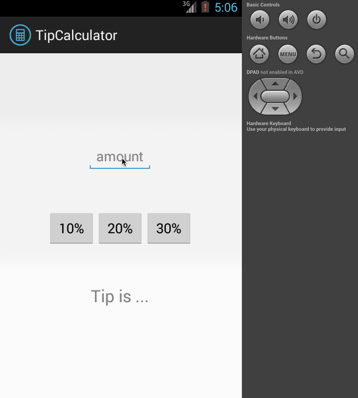

# 00 - Tip Calculator

###Overview

  * Build a Tip Calculator utility app which allows a user to calculate the appropriate tip based on the total amount entered.

###Features:

  * [x] User is displayed the tip of specified percentage for specified entered amount
  * [x] User enters the total amount of the transaction
  * [x] User can select between tip amounts (i.e 10%, 20%, 30%)
  * [x] Upon selecting tip amount, formatted tip value is displayed

###Walkthrough of all user stories:

