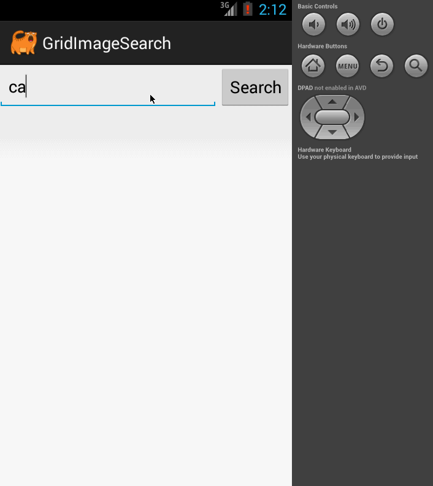

# Homework 3: Grid Image Search

###Overview:

  * Extend the Google Image Search that we built in class to allow a user to modify advanced search options and result pagination.

###Features:

  * [x] User can enter a search query that will display a grid of image results from the Google Image API.
  * [ ] User can click on "settings" which allows selection of advanced search options to filter results
  * [ ] User can configure advanced search filters such as:
    * Size (small, medium, large, extra-large)
    * Color filter (black, blue, brown, gray, green, etc...)
    * Type (faces, photo, clip art, line art)
    * Site (espn.com)
  * [ ] Subsequent searches will have any filters applied to the search results
  * [x] User can tap on any image in results to see the image full-screen
  * [ ] User can scroll down “infinitely” to continue loading more image results (up to 8 pages)

###Walkthrough of all user stories:

### Links:
  * [requirement](https://yahoo.jiveon.com/docs/DOC-3186)
  * [(video)Android Project 2: Grid Image Search](http://vimeo.com/70808495)
  * [android-async-http](https://www.dropbox.com/s/zqggkqv60zggyrt/android-async-http-1.4.5.jar?dl=1)
  * [picasso image](https://www.dropbox.com/s/25py1bmjr45936v/picasso-2.3.4.jar?dl=1)
